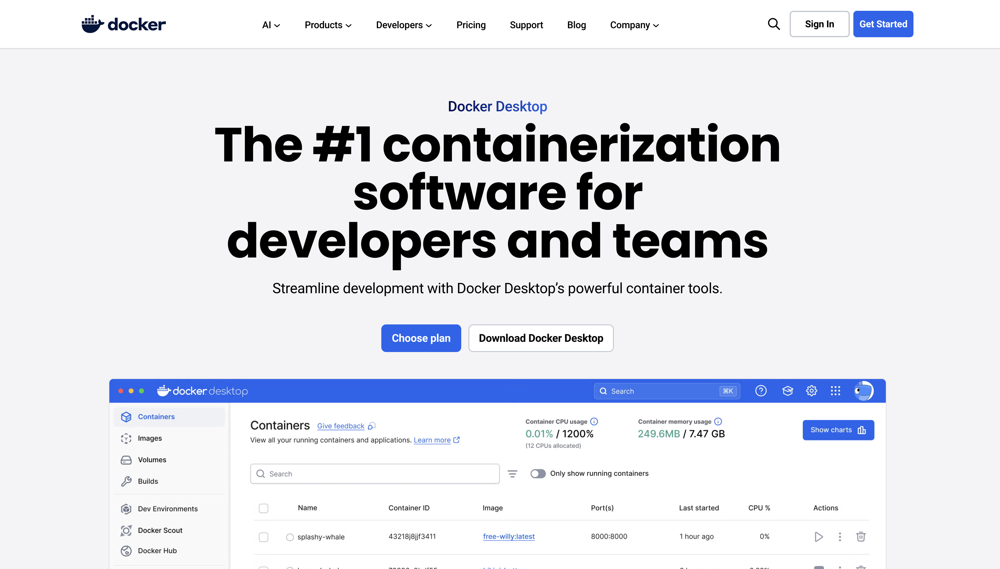
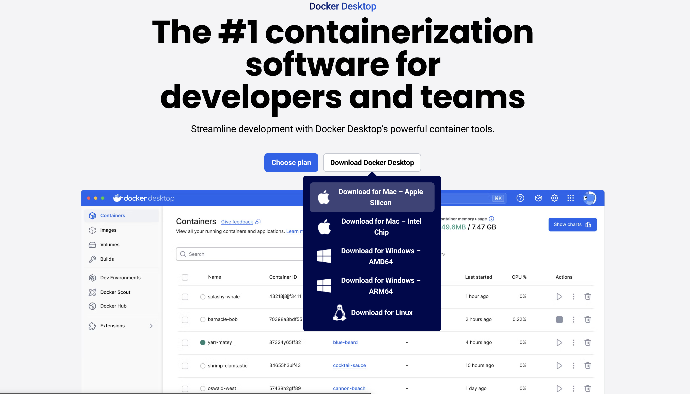
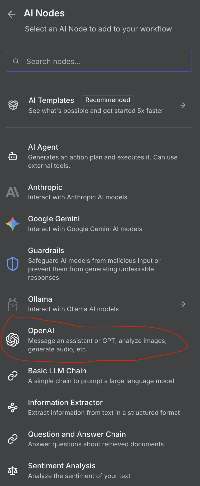

# Quick Installation and Usage Guide for n8n

A step-by-step visual guide for installing Docker Desktop and n8n, and creating your first AI workflow.

---

## 📋 Table of Contents

1. [Installing Docker Desktop](#1-installing-docker-desktop)
2. [Installing n8n with Docker](#2-installing-n8n-with-docker)
3. [Initial n8n Configuration](#3-initial-n8n-configuration)
4. [Your First Workflow](#4-your-first-workflow)
5. [Working with AI Agent](#5-working-with-ai-agent)

---

## 1. Installing Docker Desktop

### Step 1.1: Download and Install Docker Desktop

Visit [https://www.docker.com/products/docker-desktop](https://www.docker.com/products/docker-desktop) and download the version for your operating system.

 

Then choose the version for your operating system

 

**Figure 1**: Docker Desktop installation process. Follow the wizard steps to complete the installation.


### Step 1.2: Explore the Interface

 


---

## 2. Installing n8n with Docker

### Step 2.1: Search for the n8n Image

After Docker Desktop is installed and running, open the Docker Desktop application and search for the official n8n image.


**Figure 2**: In Docker Desktop, go to the Images section and search for "n8n" to find the official image.

---

### Step 2.2: Download the Image


**Figure 3**: Click the "Pull" button to download the n8n image to your local computer.

---

### Step 2.3: Run the Image


**Figure 4**: After downloading, click the "Run" button to create a new container from the n8n image.

---

### Step 2.4: Configure the Container


**Figure 5**: Configure the port (e.g., 5678) and other optional settings for the container. Click "Run" to start the container.

---

### Step 2.5: Verify Active Container


**Figure 6**: Check in the "Containers" section that the n8n container is running correctly (status: Running).

---

## 3. Initial n8n Configuration

### Step 3.1: Access the n8n Interface

Open your browser and navigate to `http://localhost:5678`


**Figure 7**: n8n authentication screen. Here you will create your owner account for the first time.

---

### Step 3.2: Customize Settings


**Figure 8**: Fill in information about your profile - name, role, type of use.

---

### Step 3.3: Activation Key (Optional)


**Figure 9**: If you have an activation key for premium features, you can enter it here. For the basic self-hosted version, you can skip this step.

---

### Step 3.4: Email Activation (Optional)


**Figure 10**: Fill in the form with your email to receive notifications and updates.

---


**Figure 11**: Confirmation that the activation email was sent successfully.

---

## 4. Your First Workflow

### Step 4.1: Start a New Workflow


**Figure 12**: From the dashboard, click "New workflow" or use one of the available templates.

---

### Step 4.2: Add the First Step


**Figure 13**: Click "+" to add a node to your workflow. This is where the construction of your automation begins.

---

### Step 4.3: Choose a Trigger


**Figure 14**: Select a trigger that will start your workflow. Options include webhooks, schedule, email trigger, etc.

---

### Step 4.4: Configure Schedule Trigger


**Figure 15**: Example configuration of a Schedule Trigger that runs the workflow at regular intervals (daily, weekly, custom cron).

---

### Step 4.5: Explore Available Applications


**Figure 16**: n8n offers hundreds of pre-built integrations with various popular applications and services.

---

### Step 4.6: Search for the Desired Application


**Figure 17**: Use the search bar to quickly find the application or service you want to connect to.

---

## 5. Working with AI Agent

### Step 5.1: On Chat Message Node


**Figure 18**: The "When chat message received" node - trigger for conversational applications and chatbots.

---

### Step 5.2: Add AI Agent


**Figure 19**: The AI Agent node allows creation of intelligent agents that can use various tools to solve complex tasks.

---

### Step 5.3: Configure the AI Model


**Figure 20**: Configure the AI model (OpenAI, Anthropic Claude, etc.) and its settings - temperature, max tokens, system prompt.


### Step 5.4: Configure Ollama



**Figure 21**: Choose ollama.


### Step 5.5: Set the Link to Ollama


**Figure 22**: Choose ollama with the setting http://host.docker.internal:11434.

---

## 🎯 Quick Workflow Examples

### Example 1: Automated Email Notification

```
Schedule Trigger (Daily 9:00 AM)
  ↓
HTTP Request (API for data)
  ↓
IF (check condition)
  ↓
Send Email (send report)
```

### Example 2: AI Chatbot

```
When Chat Message Received
  ↓
AI Agent (OpenAI GPT-4)
  ↓
Respond to Webhook (send response)
```

### Example 3: Automated Data Processing

```
Webhook Trigger
  ↓
Edit Fields (process data)
  ↓
PostgreSQL (save to DB)
  ↓
Slack (team notification)
```

---

## ⚡ Quick Docker Commands

```bash
# Check container status
docker ps

# View n8n logs
docker logs -f <container_id>

# Stop container
docker stop <container_id>

# Start container
docker start <container_id>

# Restart container
docker restart <container_id>
```

---

## 🔧 Advanced Configuration (Optional)

For a more advanced configuration with PostgreSQL and persistent volumes, create a `docker-compose.yml` file:

```yaml
version: '3.8'

services:
  n8n:
    image: n8nio/n8n:latest
    container_name: n8n
    restart: unless-stopped
    ports:
      - "5678:5678"
    environment:
      - N8N_HOST=localhost
      - N8N_PORT=5678
      - N8N_PROTOCOL=http
      - NODE_ENV=production
      - WEBHOOK_URL=http://localhost:5678/
      - GENERIC_TIMEZONE=Europe/Bucharest
    volumes:
      - n8n_data:/home/node/.n8n

volumes:
  n8n_data:
    driver: local
```

Then run:

```bash
docker-compose up -d
```

---

## 📚 Additional Resources

- **Complete Documentation**: Check the `FULL_INSTRUCTIONS_EN.md` file for the complete guide
- **Official Documentation**: [https://docs.n8n.io](https://docs.n8n.io)
- **Community**: [https://community.n8n.io](https://community.n8n.io)
- **Video Tutorials**: [https://www.youtube.com/@n8n-io](https://www.youtube.com/@n8n-io)

---

## ✅ Post-Installation Checklist

- [ ] Docker Desktop installed and running
- [ ] n8n container running correctly
- [ ] Accessed interface at `http://localhost:5678`
- [ ] Created n8n owner account
- [ ] Created first test workflow
- [ ] Tested a simple trigger
- [ ] Explored available nodes

---

## 🆘 Common Issues

### n8n won't start

```bash
# Check logs
docker logs <container_id>

# Check if port 5678 is free
netstat -an | grep 5678

# Restart container
docker restart <container_id>
```

### Cannot access interface

- Verify that the browser is accessing `http://localhost:5678`
- Check firewall
- Verify that container is running: `docker ps`

### Workflow won't save

- Verify sufficient disk space
- Check permissions for volumes
- Check logs for errors

---

## 🚀 Next Steps

After completing the installation:

1. **Explore Templates**: n8n offers dozens of ready-made templates
2. **Connect Your Applications**: Add credentials for your favorite services
3. **Create First Automation**: Start with something simple - for example, data synchronization
4. **Experiment with AI**: Try AI Agent and OpenAI nodes
5. **Automate**: Identify repetitive tasks and automate them!

---

**Success with your automations! 🎉**

*Self-hosted. Open-source. Under your control.*

